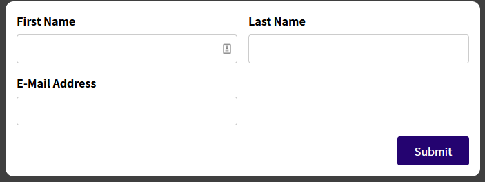

# react-webapp-11
*Section 16: Working with Forms & User Input*

- Input og form validering
- Feedback til bruker

## Assignment 5:
Lag en email field og valider den slik som name field (hente entered value, finn ut om oppfyller valid epost). Form kan submittes om begge er valid

**Se koden rett før oppgavestart:**
```
git checkout de86f4e
```


**Se min innlevering:**
```
git checkout 6cc1366
```


<!--
## Challenge:
Apply what we've learned. SimpleInput validerer nå hver input ved hjelp av generisk custom hook. Gjør nå det samme på BasicForm, som bare rendrer en HTML-form på dette punktet.

**Se startkoden**
```
git checkout 0c40aa8
```
src/components/BasicForm.js


BasicForm
-->

Resten er fulgt etter videoer