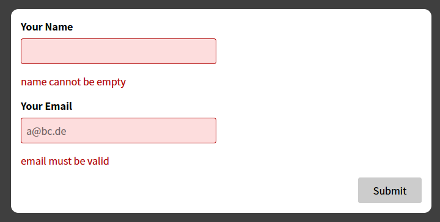
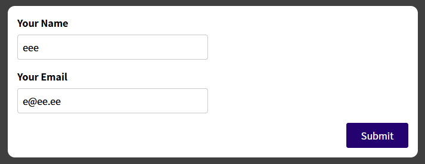

# react-webapp-11
*Section 16: Working with Forms & User Input*

Assignment 5:
Lag en email field og valider den slik som name field (hente entered value, valider) og form kan submittes om begge er valid

