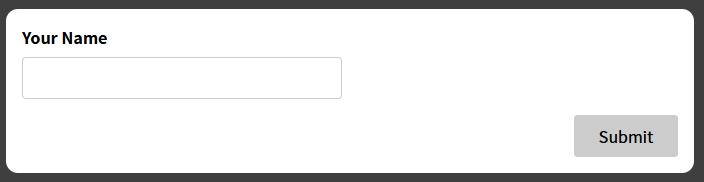

# react-webapp-11
*Section 16: Working with Forms & User Input*

## Assignment 5:
Lag en email field og valider den slik som name field (hente entered value, valider) og form kan submittes om begge er valid

**Se koden rett før oppgave:**
```
git checkout de86f4e
```


**Se min innlevering:**
```
git checkout 6cc1366
```


